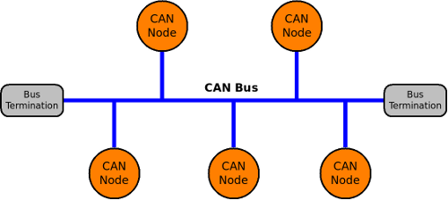
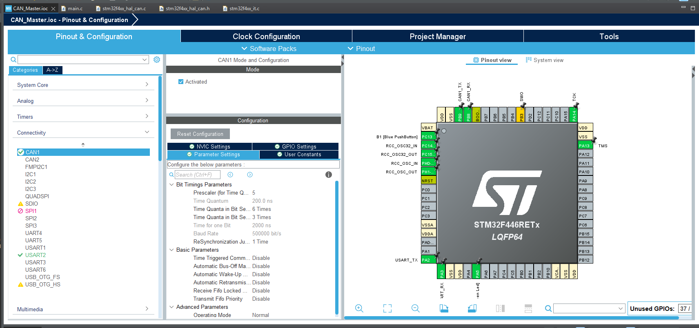

---
# Controller Area Network (CAN)
----
## What is CAN?
**Controller Area Network (CAN)** is a robust, differential, serial communication bus standard originally designed for automotive applications, but now widely used in embedded systems where multiple microcontrollers need to communicate reliably.

- It allows multiple devices (nodes) to communicate without a central host.
- Uses **differential signaling** on two wires: CAN_H and CAN_L.
- Built for **noise immunity** and **fault tolerance**, making it great for vehicles and industrial environments.



<div style="background-color: #fff9db; border-left: 4px solid #fbc02d; padding: 1em; margin: 1em 0; border-radius: 6px; font-family: inherit; color: #4f4f4f;">

**Example**

Imagine a car:  
- One component measures wheel speed  
- Another controls braking  
- Another controls the engine  

All ECUs must share information. Instead of direct point-to-point wiring, they all send/receive messages over a single **CAN bus**.

CAN ensures proper data is sent throughout the car. Avoiding inevitable interference with the signals. 

 </div>

---

## How CAN Communication Works
Each CAN message contains:
- **Identifier (ID)** – this basically defines the priority and meaning of the message. The lower ID = higher priority.
- **Data field** – this is the data sent, it can range from up to 8 bytes in Classical CAN or up to 64 bytes in CAN FD.
- **CRC** – error checking.
- **ACK** – acknowledgement sent from other nodes.

CAN is **message-based**, not node-based:
- Any node can transmit so long as the bus is free.
- Arbitration is what resolves conflicts. If multiple nodes try to send data at once the lowest ID wins.


<div style="background-color: #f0f8ff; border-left: 4px solid #2196F3; padding: 1em; margin: 1em 0; border-radius: 6px; font-family: inherit; color: #4f4f4f;">

**Extra**

Why is this better than UART/SPI/I2C?  
- CAN can have **many nodes** on one bus.  
- Even if one of the nodes fail, the rest keep running properly.  
- CAN has **built-in error detection and retransmission**.  

</div>

---

## CAN Signal Levels
- **Dominant (logic 0)** → CAN_H ≈ 3.5V, CAN_L ≈ 1.5V  
- **Recessive (logic 1)** → CAN_H ≈ 2.5V, CAN_L ≈ 2.5V  

Since it’s differential:
- Better noise immunity  
- Allows longer cables (tens of meters in cars, hundreds in industrial use)  

---

## Using CAN with an STM32

<div style="background-color: #f0f8ff; border-left: 4px solid #2196F3; padding: 1em; margin: 1em 0; border-radius: 6px; font-family: inherit; color: #4f4f4f;">

**Extra**

STM32Cube includes CAN peripheral support in both **HAL** and **LL** APIs.  
You’ll need:  
- CAN peripheral enabled in `.ioc`  
- Pins configured for **CAN_TX** and **CAN_RX**  
- Proper bus speed setup (commonly 500 kbps in automotive)  
- External **transceiver** (e.g. MCP2551, TJA1050) since STM32 CAN works on logic levels, not directly on the differential bus.  

</div>

**Step 1**  
Open your `.ioc` file:  
- Go to **Pinout and Configuration**  
- Enable **CAN1** (or CAN2 depending on MCU)  
- Assign pins (e.g., `PA11 → CAN_RX`, `PA12 → CAN_TX`)  



**Step 2**  
You can use the HAL CAN functions in your code. Examples:

- `HAL_CAN_Start(&hcan)`  
  *Enables CAN peripheral.*

- `HAL_CAN_AddTxMessage(&hcan, &TxHeader, TxData, &TxMailbox)`  
  *Transmits a CAN frame.*

- `HAL_CAN_GetRxMessage(&hcan, FIFO, &RxHeader, RxData)`  
  *Receives a CAN frame.*

**Example:**

```c
CAN_TxHeaderTypeDef TxHeader;
uint8_t TxData[8] = {0x11, 0x22, 0x33, 0x44};
uint32_t TxMailbox;

TxHeader.StdId = 0x123;
TxHeader.DLC = 4;
TxHeader.IDE = CAN_ID_STD;
TxHeader.RTR = CAN_RTR_DATA;

if (HAL_CAN_AddTxMessage(&hcan1, &TxHeader, TxData, &TxMailbox) != HAL_OK) {
    // Transmission error
}
