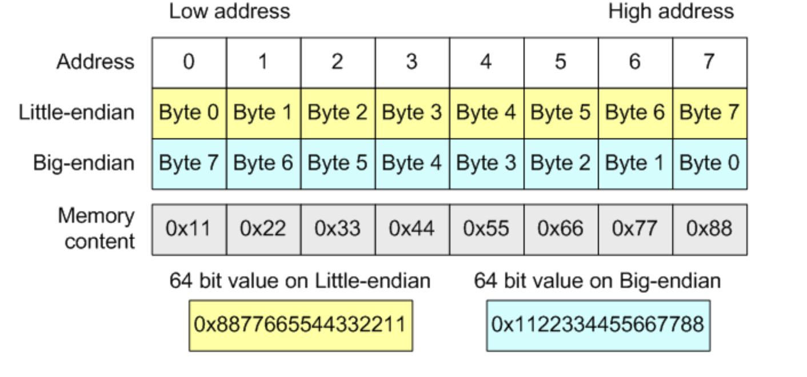

<link rel="stylesheet" href="../styles.css">

# Core Concepts 🧑‍💻
## What is Embedded?
Embedded systems are the bridge between electrical systems and programming. Embedded programmers work on tiny computers called microcontroller (MCUs). These are chips that are basically small computers designed to control electronic devices. Almost every device we see involves embedded systems. From TVs to washing machines to cars, they're everywhere!

Embedded work at the FSGP race in 2025! This picture shows the boards for the battery protection system that the embedded team programmed.

 

## Different types of Embedded Systems
Embedded Systems can be classified into different categories. They are:
1. Stand Alone Embedded Systems: These are also called "bare metal". Lowkey, let's just call these bare metal only. They have no operating system and just works by itself. Examples include microwaves, calculators and the Solar Car's CCP boards!
2. Real Time Embedded Systems: These are systems that integrate an operating system. They are more complex than bare metal system. Examples of this would be pacemakers or the Solar Car's MBMS board!
3. Networked Embedded Systemss: These use networks such as LAN or the internet. Examples would include a home security system.
4. Mobile Embedded Systems: These are the embedded systems in cell phones. We don't do that stuff in Solar Car.

---
 
 

# Terminology

## Microprocessor vs Microcontroller
A _microprocessor_ is a silicon chip that is able to perform arithmetic and logical operations. This chip is called a CPU. It is dependent on other chips for timers, memory chips, etc. It also doesn't contain built in input/output ports.

A _microcontroller_ contains a lot more and has it's own CPU, RAM, memory storage, FLASH memory, timer, interrupt control units, and input/output ports. 

## Software vs Firmware vs Hardware
_Software_ is more high-level (more abstract) and less similar to machine code and more similar to human language

_Firmware_ is more low-level and similar to machine code and tells the hardware what to do.

_Hardware_ is the physical components.

---

 
 

## Endianness
When we are reading data, we need to know where to start from. Similar to how some languages read from left to right such as English while others from right to left such as Arabic, data also has that variability. That is what we call endianness. There are two types: little-endian and big-endian. **Remember that the lowest address is the left-most one**
- Litte-endian means the lowest-order byte will be stored at the lowest-address. Btye 0 will be at address "0", while byte 1 will be higher at address "1".
- Big-endian means that the highest-order byte will be at the lowest address. Byte 0 will be at address "1", while byte 1 will be at address "0".

Endianness example

## RTOS

## ISRs

## Embedded C Programming

## Your Future Job as an Embedded Programmer 🧙‍♀️
So! Now, you're on the embedded team. A team that plays an integral part on making our car run. Congratulations! Your job will be to communicate with the electrical team, write code for a specific purpose of the car, and then test it! These projects can control important parts of the car such as making sure it don't blow up! You can use this opportunity to learn a lot and grow, so I hope you do and try your best! 

## Using ADC with an STM32

Last Updated: August 17, 2025
Note: Working on it
Author: Khadeeja Abbas

