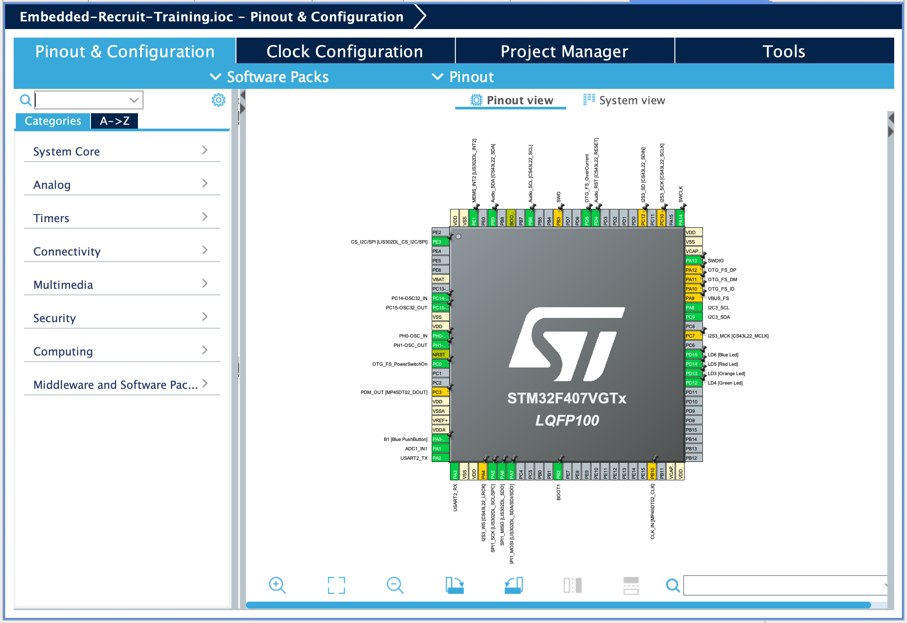
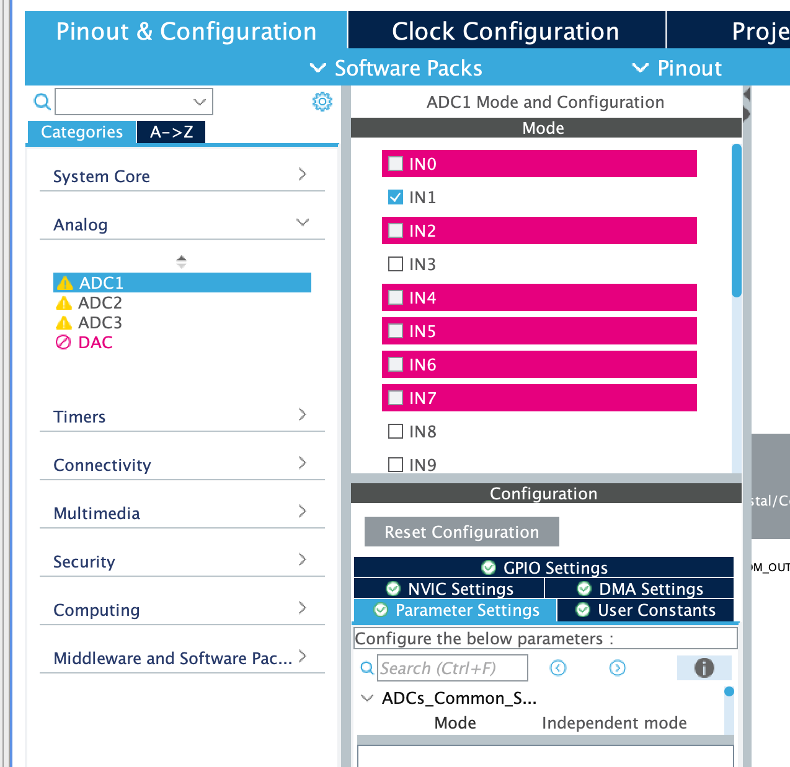
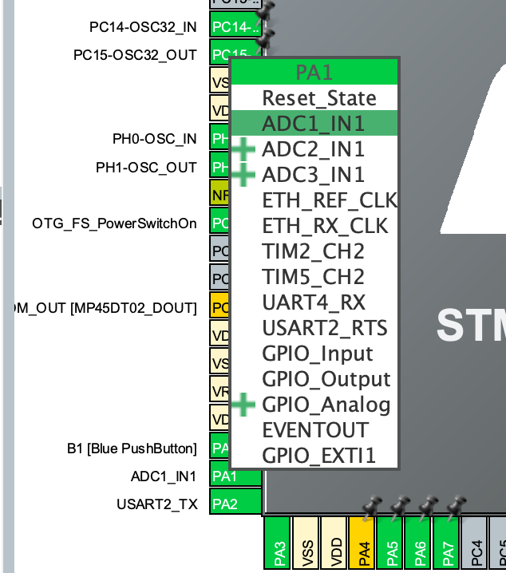
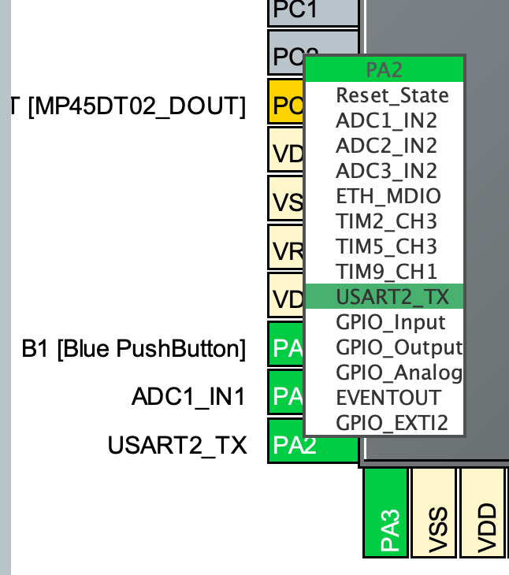
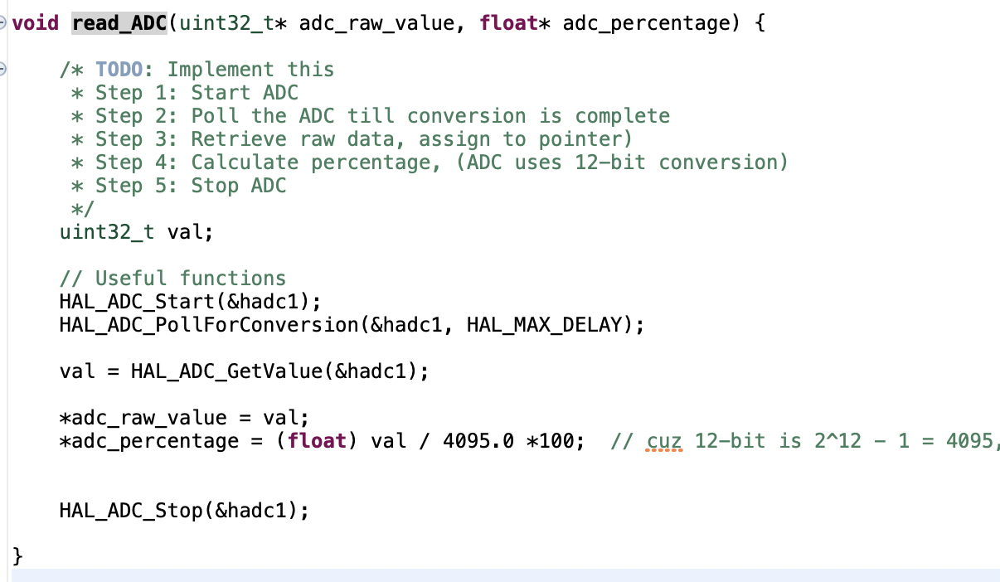

<link rel="stylesheet" href="../styles.css">

# Core Concepts 🧑‍💻

## What is Embedded?
Embedded systems are the bridge between electrical systems and programming. Embedded programmers work on tiny computers called microcontroller (MCUs). These are chips that are basically small computers designed to control electronic devices. Almost every device we see involves embedded systems. From TVs to washing machines to cars, they're everywhere!

Embedded work at the FSGP race in 2025! This picture shows the boards for the battery protection system that the embedded team programmed.

## Different types of Embedded Systems
Embedded Systems can be classified into different categories. They are:
1. Stand Alone Embedded Systems: These are also called "bare metal". They have no operating system and just works by itself. Examples include microwaves, calculators and the Solar Car's CCP boards!
2. Real Time Embedded Systems: These are systems that integrate an operating system. They are more complex than a stand alone embedded system. Examples of this would be pacemakers or the Solar Car's MBMS board!
3. Networked Embedded Systemss: These use networks such as LAN or the internet. Examples would include a home security system.
4. Mobile Embedded Systems: These are the embedded systems in cell phones. We don't do that stuff in Solar Car.

## Microprocessor vs Microcontroller
A _microprocessor_ is a silicon chip that is able to perform arithmetic and logical operations. This chip is called a CPU. It is dependent on other chips for timers, memory chips, etc. It also doesn't contain built in input/output ports.
A _microcontroller_ contains a lot more and has it's own CPU, RAM, memory storage, FLASH memory, timer, interrupt control units, and input/output ports. 

## Endianness
When we are reading data, we need to know where to start from. Similar to how some languages read from left to right such as English while others from right to left such as Arabic, data also has that variability. That is what we call endianness. There are two types: little-endian and big-endian. **Remember that the lowest address is the left-most one**
- Litte-endian means the lowest-order byte will be stored at the lowest-address. Btye 0 will be at address "0", while byte 1 will be higher at address "1".
- Big-endian means that the highest-order byte will be at the lowest address. Byte 0 will be at address "1", while byte 1 will be at address "0".

Endianness example

## Analog-to-Digital Converter (ADC)

Physical quantities are captured by some sort of sensor, and are usually reflected as something such as a voltage (usually with infinite values in between due to being continuous). 

We can convert the analog signal to a digital representation by using sampling, and quantization.

- **Sampling** is measuring the signal at a periodic rate

**Resolution** is defined as: *resolution* = Vref/(2^n)
- It is the number of volts between successive digital encodings
- n = number of biys for each sample
- This equation assumes a minimum voltage of 0V

**Example**

For example, this is how 10-bit resolution would work:

Since there are 10 bits, 2^10 is 1024. This means there are 1024 discrete values we can use (0-1023). If we had a sensor to detect a voltage ranging from 0-3V, receiving the ADC value of 1002 would mean that it is currently sensing a voltage of (1002/1023) * 3V = 2.94V.

Great! Now how do we use ADC in the context of our system???

**Extra**

Digital to Analog Converters (DACs) also exist. They convert from digital to analog (usually used when you need to output something analog like sound). You can also look into Pulse Width Modulation (PWM) which is somewhat similar in usage to a DAC and can produce a varyng output but is done with a duty cyce where for example if you want to dim an LED you might have it on for 50% of a duty cycle and off for 50% of a duty cycle (rather than on for 100% of the cycle). Ideally, it will turn on and off so quickly it will just look dim rather than flashing. 

## Using ADC with an STM32

**Extra**

STM32Cube includes:

• STM32CubeMX, a graphical software configuration tool that allows the generation of C initialization code using graphical wizards.
• A comprehensive embedded software platform, delivered per Series (such as STM32CubeF4 for STM32F4 Series)
- The STM32Cube HAL, STM32 abstraction layer embedded software ensuring maximized portability across the STM32 portfolio. HAL APIs are available for all peripherals.
- Low-layer APIs (LL) offering a fast light-weight expert-oriented layer which is closer to the hardware than the HAL. LL APIs are available only for a set of peripherals.
- A consistent set of middleware components such as RTOS, USB, TCP/IP and Graphics. 
- All embedded software utilities, delivered with a full set of examples.

**Step 1**
Go to the .ioc file. It will look similar to this:

Click on "Pinout and Configuration" at the top left, then "Analog" on the left. Here you can select an ADC to use! (for example select ADC1). 

Note: You can click 'ctrl' ('cmd' for macs) and left click on the pins to see what they can be used for. Clicking on PA1, we can see what the pin can be used for. Currently, we have ADC1_IN1 selected, which means we are using pin PA1 for ADC. We can see from the ADC config that we do indeed have IN1 selected for ADC1, and that some of the others are pink and unable to be selected such as IN2. This is because the correlated pin PA2 is currently being used for a different peripheral! We can see that the pin PA2 can be used as an ADC1_IN2, but we currently are using it for USART.

Possible uses for PA1 and PA2 for this specific microcontroller:
  

**Step 2**
Wherever you need to do your basic ADC conversion (I suggest making a function for it), you can use the functions:

- HAL_StatusTypeDef HAL_ADC_Start(ADC_HandleTypeDef *hadc)
  * @brief  Enables ADC and starts conversion of the regular channels.
  * @param  hadc pointer to a ADC_HandleTypeDef structure that contains the configuration information for the specified ADC.
  * @retval HAL status

- HAL_StatusTypeDef HAL_ADC_PollForConversion(ADC_HandleTypeDef *hadc, uint32_t Timeout)
  * @brief  Poll for regular conversion complete
  * @note   ADC conversion flags EOS (end of sequence) and EOC (end of conversion) are cleared by this function.
  * @note   This function cannot be used in a particular setup: ADC configured in DMA mode and polling for end of each conversion (ADC init parameter "EOCSelection" set to ADC_EOC_SINGLE_CONV). In this case, DMA resets the flag EOC and polling cannot be performed on each conversion. Nevertheless, polling can still be performed on the complete sequence.
  * @param  hadc pointer to a ADC_HandleTypeDef structure that contains the configuration information for the specified ADC.
  * @param  Timeout Timeout value in millisecond.
  * @retval HAL status

- uint32_t HAL_ADC_GetValue(ADC_HandleTypeDef *hadc)
  * @brief  Gets the converted value from data register of regular channel.
  * @param  hadc pointer to a ADC_HandleTypeDef structure that contains the configuration information for the specified ADC.
  * @retval Converted value

- HAL_StatusTypeDef HAL_ADC_Stop(ADC_HandleTypeDef *hadc)
  * @brief  Disables ADC and stop conversion of regular channels.
  * @note   Caution: This function will stop also injected channels.
  * @param  hadc pointer to a ADC_HandleTypeDef structure that contains the configuration information for the specified ADC.
  * @retval HAL status.

For example, your code might look like:

Note: Here to get the percentage we are dividing by 4095, because its 12-bit resolution

--- 

## Useful Things!

<a href="https://www.disca.upv.es/aperles/arm_cortex_m3/llibre/st/STM32F439xx_User_Manual/group__adc__exported__functions.html" style = "color: #f0f8ff" >STM32F439xx HAL User Manual (ADC)
</a>

<a href="https://deepbluembedded.com/stm32-adc-tutorial-complete-guide-with-examples/#:~:text=ADC%20Example%20Applications-,Introducing%20STM32%20ADC,trigger%20it%20to%20start%20conversion" style = "color: #f0f8ff" >More on STM32 ADC
</a>

---
Last Updated: August 6, 2025
Note: Took a some things from my lectures lol 

