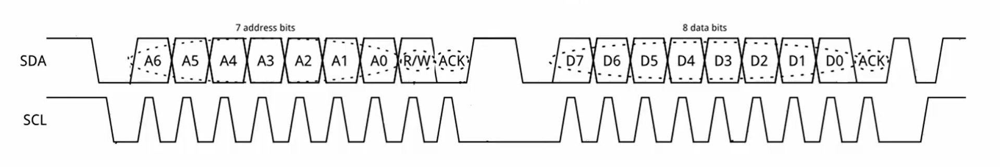

# Onboarding - I2C

## What is I2C?
I2C (or IIC) stands for Inter-Integrated Circuit. It’s a protocol that lets one integrated circuit (IC) control multiple other ICs using just two lines. Basically, one “Master” (the IC doing the controlling) can communicate with multiple “Slaves” (the ICs being controlled). It uses two lines, SDA, the data line (bidirectional), and the SCL, the clock line.

The SDA line is used to send and receive data, but only one device talks at a time. The Master picks which Slave to talk to by sending its address over SDA. To start communication, the Master pulls SDA low, then SCL low shortly after.

The Master then sends the address of the Slave it wants to talk to, followed by a bit to say whether it wants to read (R/W = 1) or write (R/W = 0). If R/W = 0, the Master sends data and the Slave receives it. If R/W = 1, the Slave sends data and the Master receives it. An acknowledgment bit (ACK) is sent by the receiver by pulling the line low. The line goes high again when the sender is done. To end the communication, SCL goes high first, then SDA.

Here is an example of how the lines may flow, where the As represent the master sending an address (picking a slave), an instruction, and an acknowledgement but tells the master the slave received the instruction. After a short pause the Ds represent the data and the acknowledgment  bit in the end indicates that the process is done

### Example:



This diagram is an example of how the lines might look in action. The A bits represent the Master sending a 7-bit address to pick a specific Slave, followed by the R/W bit (read or write) instruction, and then an acknowledgment bit, which tells the Master that the Slave received the instruction. After a short pause, the D bits represent the 8-bit data being sent, and at the end, there’s another acknowledgment bit to confirm the data was received. This indicates that the communication was successful and the process is done.

## Pros 
• Only 2 lines (+ power and ground) <br> 
• Built in addressing 

## Cons
 • Half duplex → bidirectional but not simultaneous, limits bandwidth, slower, can cause collisions <br> 
 • Each peripheral must have a unique address or data clashes <br> 
 • Harder than SPI and UART 

## Coding in STM:
HAL (Hardware Abstraction Layer) is a set of libraries provided by STMicroelectronics to simplify the development process on STM32 microcontrollers. HAL provides a high-level interface for interacting with the MCU's peripherals like GPIO, SPI, UART, and more, allowing developers to write code that is more portable across different STM32 devices. By using HAL, developers can avoid dealing directly with hardware registers, which speeds up development, improves readability, and reduces the complexity of peripheral configurations.

You will be coding using HAL library functions, this line reads data from a specific memory address on an I2C device:

```c
**'HAL_StatusTypeDef HAL_I2C_Mem_Read(I2C_HandleTypeDef *hi2c, uint16_t DevAddress, uint16_t MemAddress, uint16_t MemAddSize, uint8_t *p)'**

hi2c: I2C handle
DevAddress: I2C device address.
MemAddress: Memory address.
MemAddSize: Size of the memory address.
pData: Data buffer.
Size: Size of the data.