---
# Inter-Integrated Circuit (I2C)
---
## What is I2C?
What is I2C?
I2C (or IIC) stands for Inter-Integrated Circuit. It’s a protocol that lets one integrated circuit (IC) control multiple other ICs using just two lines. Basically, one “Master” (the IC doing the controlling) can communicate with a single or multiple “Slave(s)” (the ICs being controlled such as sensors, displays, etc). It uses two lines, SDA, the data line (bidirectional), and the SCL, the clock line.
### Master and a single slave:
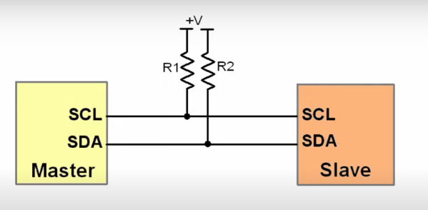

### Master and multiple slaves:
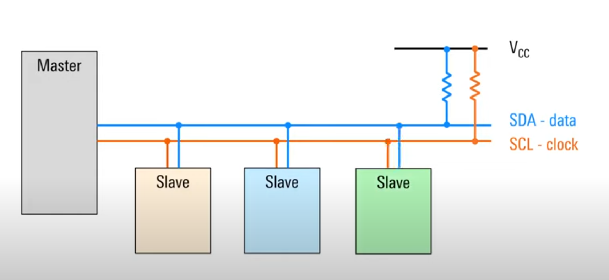

The SDA line is used to send and receive data, but only one device talks at a time. The Master picks which Slave to talk to by sending its address over SDA. To start communication, the Master pulls SDA low, then SCL low shortly after.

The Master then sends the address of the Slave it wants to talk to, followed by a bit to say whether it wants to read (R/W = 1) or write (R/W = 0). If R/W = 0, the Master sends data and the Slave receives it. If R/W = 1, the Slave sends data and the Master receives it. An acknowledgment bit (ACK) is sent by the receiver by pulling the line low. The line goes high again when the sender is done. To end the communication, SCL goes high first, then SDA.

Here is an example of how the lines may flow, where the As represent the master sending an address (picking a slave), an instruction, and an acknowledgement but tells the master the slave received the instruction. After a short pause the Ds represent the data and the acknowledgment  bit in the end indicates that the process is done

### Example:


This diagram is an example of how the lines might look in action. The A bits represent the Master sending a 7-bit address to pick a specific Slave, followed by the R/W bit (read or write) instruction, and then an acknowledgment bit, which tells the Master that the Slave received the instruction. After a short pause, the D bits represent the 8-bit data being sent, and at the end, there’s another acknowledgment bit to confirm the data was received. This indicates that the communication was successful and the process is done.

## Pros 
• Only 2 lines (+ power and ground) <br> 
• Built in addressing 

## Cons
 • Half duplex → bidirectional but not simultaneous, limits bandwidth, slower, can cause collisions <br> 
 • Each peripheral must have a unique address or data clashes <br> 
 • Harder than SPI and UART 

## STM32 Intro:
Once you successfully import the project into your local stm repo, start by expanding the folder and opening the ioc file.

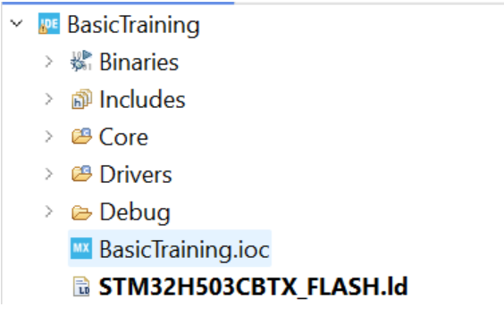

You should see something similar to this:
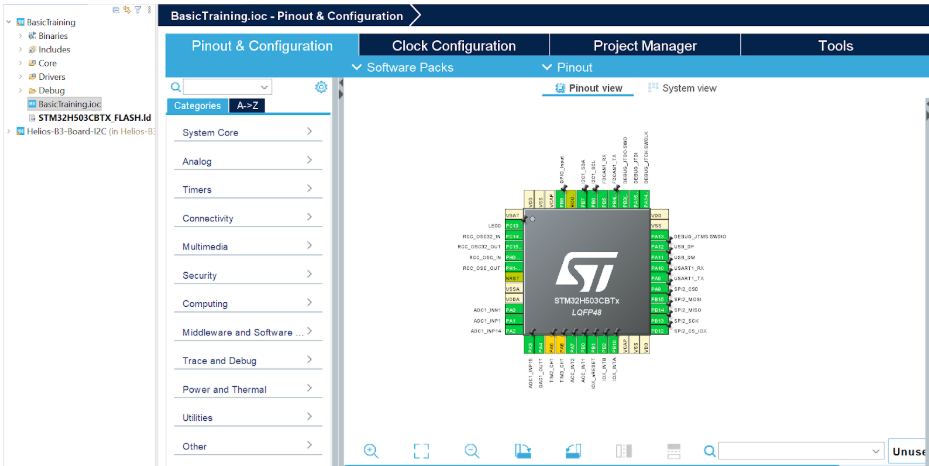

Boards used in solar cars mainly use STM32 chips. To program these boards two pieces of software are used: stm32cubemx and stm32cubeide. cubemx is used to place and route pins on the microcontroller (basically choose what pins do what), and the IDE is used to actually program the microcontroller to do specific tasks. The board MX we are using looks like:

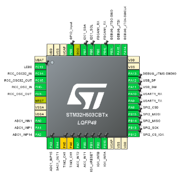

To place and route pins, click on the desired pin and select what you want it to be used for (a single pin can have multiple functions).

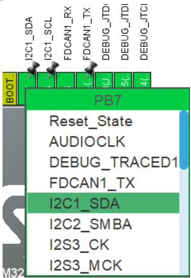

For I2C there are only two main pins: scl and sda (as explained earlier), and both have to be routed on the microcontroller. For the training pins for testing I2C have already been selected as PB6 (SCL) and PB7 (SDA):

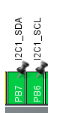

After pins have been chosen, you have to click Device Configuration Tool Code generation in your task bar: 

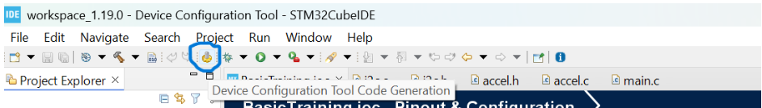

This step maps your chosen pins to their function and automatically generates code. that code will usually show up in main.c if you’re looking at it from a c/c++ programming perspective.

## Coding in STM:
Before implementing I2C, you should know what HAL is. HAL (Hardware Abstraction Layer) is a set of libraries provided by STMicroelectronics to simplify the development process on STM32 microcontrollers. HAL provides a high-level interface for interacting with the MCU's peripherals like GPIO, SPI, UART, and more, allowing developers to write code that is more portable across different STM32 devices. By using HAL, developers can avoid dealing directly with hardware registers, which speeds up development, improves readability, and reduces the complexity of peripheral configurations.

You will be coding using HAL library functions, this line reads data from a specific memory address on an I2C device:

```c
**'HAL_StatusTypeDef HAL_I2C_Mem_Read(I2C_HandleTypeDef *hi2c, uint16_t DevAddress, uint16_t MemAddress, uint16_t MemAddSize, uint8_t *p)'**

hi2c: I2C handle
DevAddress: I2C device address.
MemAddress: Memory address.
MemAddSize: Size of the memory address.
pData: Data buffer.
Size: Size of the data.
```

## Implementing I2C:
Now to implement I2C, we’ll be sending and receiving data from the accelerometer IC and reading its values. for this part of the training, the goal is to program the accelerometer so you can view the x, y, and z readings as you move the board.

Before proceeding further...
_________________________________________________
**What is an accelerometer?**

Accelerometers are ICs used to measure the acceleration, the rate of change of an object's velocity. Most accelerometers detect acceleration in three axes (x, y, z). This acceleration is converted into an electrical signal, which can be used for various different things such as determining position, identifying vibrations, etc. 

**What are they used for?**

Many things! Accelerometers are used for a wide variety of applications such as air bag deployment in cars to gaming motion input. Which accelerometer should be used for an application depends on its main purposes and requirements, such as measurements, sensitivity, temperature where it can operate, etc. The accelerometer is a ‘slave’ and I2C the master sending signals (refer back to onboarding I2C info). 

The accelerometer you are using/the one on the board is the MC3479 (the datasheet is linked below under 'Useful Links').
 ___________________________________________________________________________

Now, returning to the IDE:

The I2C files themselves handle I2C setup and initialization, but to actually program the accelerometer we use different files: accel.h and accel.c.

**.h files (headers)** store declarations like functions, variables, and classes.

**.c files (source)** implement the functions declared in the header.

This is **accel.h** file which has the four functions you will use:
```c
HAL_StatusTypeDef accel_init(I2C_HandleTypeDef *hi2c);  //initialize the accelerometer: check chip id, set sample rate and range
	
void accel_read_raw(int16_t *x, int16_t *y, int16_t *z); //read raw x, y, z values from accel registers over I2C (returns lsb counts)

void accel_read_g(float *pos_xg, float *pos_yg, float *pos_zg); //convert raw counts (lsb/bit) into acceleration in g units

void accel_poll_data(float *pos_x, float *pos_y, float *pos_z); //convert g values into m/s^2
```
Now going to **accel.c**, we’ll start by initializing the accelerometer.

To use the accelerometer (or any IC), you first have to initialize it. Initializing an IC means setting it up so that it’s ready to communicate and operate properly, this includes making sure you’re on the correct device, configuring its frequency, and setting other control parameters as needed.

For the accelerometer, three values are set: the who-am-i register, the sample rate, the range/LPF, and its mode register.

**Who-Am-I register:**  
The **Who-Am-I register** (also called the Chip Identification Register) is used to verify that communication is established with the correct device.  
According to the datasheet, register 0x18 always contains the value 0xA4 for the MC3479 accelerometer: 
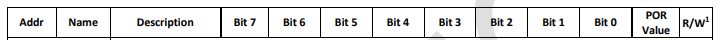  
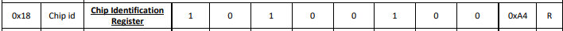
This step ensures that the MCU is talking to the right device and not another I2C component on the same bus. 

In the following line of code, we read register 0x18 and check whether the value returned is 0xA4. If the value matches, it confirms that we’re communicating with the correct IC.
```c
uint8_t chip_id = 0; 
HAL_I2C_Mem_Read(hi2c, (ACCELEROMETER_DEVICE_ADDR << 1), 0x18, I2C_MEMADD_SIZE_8BIT, &chip_id, 1, 100);
if (chip_id != 0xA4)
    return HAL_ERROR;
```
**Sample Rate:**  
The **sample rate** register sets the frequency at which the accelerometer measures and outputs data. This is important because if you have a higher sample rate, you get more responsive data but use more power. A lower sample rate means less frequent updates but lower power.  
According to the datasheet, the MC3479 accelerometer’s sample rate can be set from 0.5 to 2000 samples per second. For the I2C (and SPI) interface, it supports 8 different sample rates:

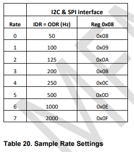

In the following line of code, we write the value 0x09 to register 0x08, which sets the accelerometer’s sample rate to 100 Hz. If the write operation is successful, it confirms that the device’s sample rate has been configured correctly through I2C communication. 
```c
uint8_t sample_rate = 0x09; 
HAL_I2C_Mem_Write(hi2c, (ACCELEROMETER_DEVICE_ADDR << 1), 0x08, I2C_MEMADD_SIZE_8BIT, &sample_rate, 1, 100);
```
In the following line of code, we write the value 0x09 to register 0x08, which sets the accelerometer’s sample rate to 100 Hz. If this write operation is successful, it confirms that the device’s sample rate has been configured correctly through I2C communication.

**Range and LPF:**  
The **range** and **low-pass filter (LPF)** register controls how the accelerometer interprets and filters acceleration data. 

The **range** sets the maximum level of acceleration the sensor can measure. The MC3479 has 5 different ranges. Lower ranges mean higher precision, while higher ranges can handle stronger forces but at the cost of reduced accuracy.

The **low-pass filter (LPF)** helps smooth out high-frequency noise and vibrations, giving more stable readings. There are 4 different LPF settings in the MC3479 (reserved ones don’t have defined behaviour, so keep them as zero), each used for different purposes and varying in cutoff frequency. The lower the cutoff, the smoother the noise but the slower the sensor is to respond.

We will implement a ±2g range, which means the device can detect motion within ±19.62 m/s², giving the accelerometer high sensitivity for smaller movements. If the acceleration goes beyond this limit, the sensor will output its maximum possible value, and the LPF is disabled.
This can be implemented using the information in the following image, which shows what bits represent what and what numbers to set them at to get the desired output.
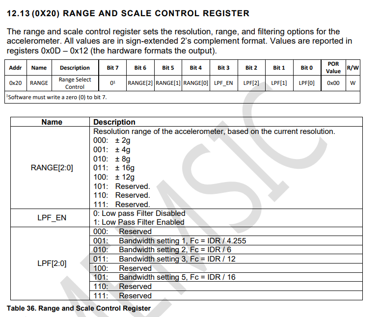

In the following line of code, we write the value 0x00 to register 0x20, which sets the accelerometer’s measurement range to ±2g. This configuration gives the sensor high sensitivity for detecting small movements and ensures it outputs raw, unfiltered data since the LPF is disabled.
```c
uint8_t range_lpf = 0x00; //±2g
HAL_I2C_Mem_Write(hi2c, (ACCELEROMETER_DEVICE_ADDR << 1), 0x20, I2C_MEMADD_SIZE_8BIT, &range_lpf, 1, 100);
```

**Mode Register:**
The **mode register** asically activates the accelerometer, turns it on so that it can start measuring data.  
We want to wake up the sensor and start acquiring data on the X, Y, and Z axes at the set sample rate. We also want to activate the I2C WDT NEG and POS, which are internal timers that check whether the SCL line has been high or low for too long. If that happens, they reset the I2C internal interface.

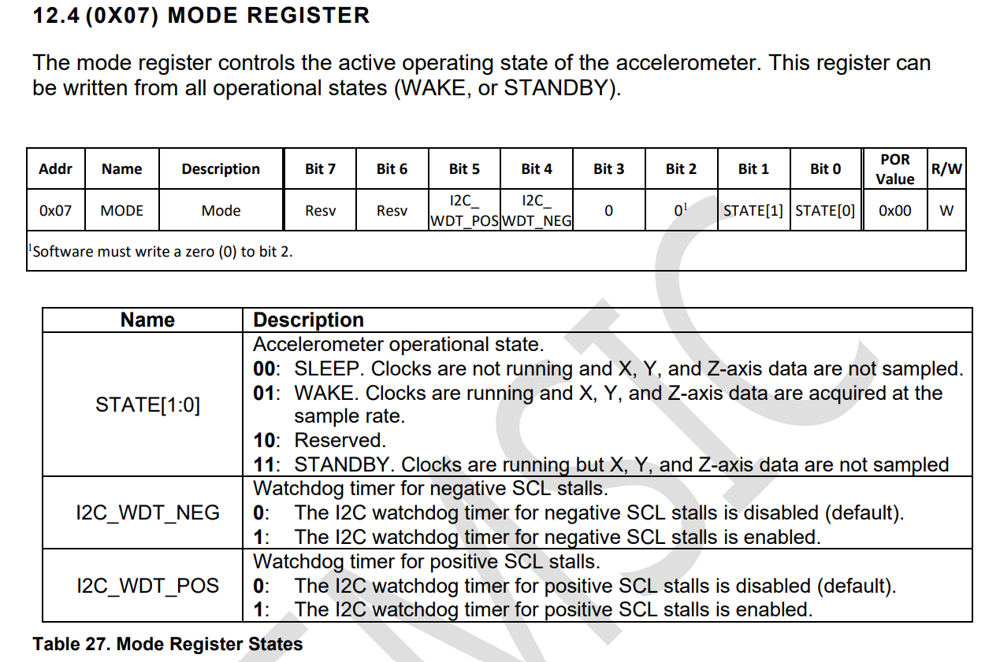

In this line of code we are writing to register 0x07 and sending the value 0x07, which tells the device to wake up and sets the internal timers.
```c
uint8_t mode = 0x07; //mode
HAL_I2C_Mem_Write(hi2c, (ACCELEROMETER_DEVICE_ADDR << 1), 0x07, I2C_MEMADD_SIZE_8BIT, &mode, 1, 100);
```

**Now**, altogether, the initialization function in accel.c looks like this:
```c
HAL_StatusTypeDef accel_init(I2C_HandleTypeDef *hi2c) {
    uint8_t chip_id = 0; //who-am-i/chip identification reg
    HAL_I2C_Mem_Read(hi2c, (ACCELEROMETER_DEVICE_ADDR << 1), 0x18, I2C_MEMADD_SIZE_8BIT, &chip_id, 1, 100);
    if (chip_id != 0xA4)
    	return HAL_ERROR;

    uint8_t sample_rate = 0x09;  //100Hz
    HAL_I2C_Mem_Write(hi2c, (ACCELEROMETER_DEVICE_ADDR << 1), 0x08, I2C_MEMADD_SIZE_8BIT, &sample_rate, 1, 100);

    uint8_t range_lpf = 0x00; //±2g
    HAL_I2C_Mem_Write(hi2c, (ACCELEROMETER_DEVICE_ADDR << 1), 0x20, I2C_MEMADD_SIZE_8BIT, &range_lpf, 1, 100);

    uint8_t mode = 0x07; //mode reg
    HAL_I2C_Mem_Write(hi2c, (ACCELEROMETER_DEVICE_ADDR << 1), 0x07, I2C_MEMADD_SIZE_8BIT, &mode, 1, 100);

    return HAL_OK;
}
```

## Your Task: ----


## Useful Links:

What is I2C: https://www.analog.com/en/resources/technical-articles/i2c-primer-what-is-i2c-part-1.html

Datasheet for MC3479 Accelerometer: https://www.memsic.com/Public/Uploads/uploadfile/files/20220522/MC3479Datasheet%28APS-048-0072v1.2%29.pdf 