<link rel="stylesheet" href="../styles.css">

# RTOS ⏰
Real-Time Operating System (RTOS)

## Operating Systems
You've probably heard of the following operating systems: Mac, Windows, IOS, Android. These are **systems that run on your computer or microcontroller** that **manage when tasks** are executed such as opening Chrome, manage reading and writing to files, and interacting with external devices. Imagine if we didn't have operating systems to do these tasks. If you wanted to open Chrome to Google something, your device wouldn't know what task to prioritize. Should it prioritize moving your cursor, download that app you wanted, or open the browser? **With all this confusion, we can expect one thing: lag!** No one likes lag, that's why we use operating systems to manage our tasks.

### Scheduling

There are **different ways to schedule tasks on the microprocessor**. These can be split into two categories: **Preemptive and Non-preemptive.**

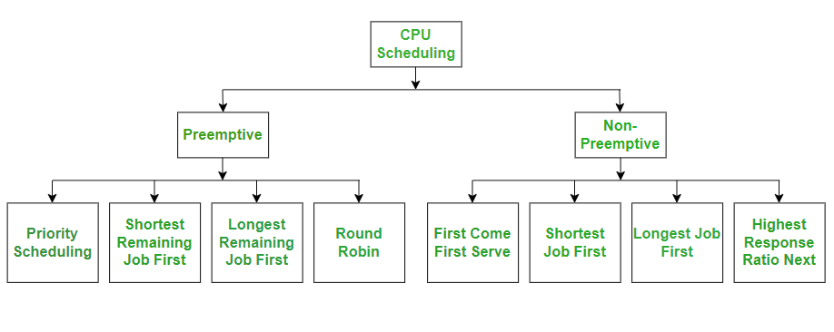

Different categories of scheduling ways.

**_Preemptive_** scheduling means the OS is allowed to interrupt a task and switch to a higher priortiy one. 

**_Non-preemptive_** scheduling means the task runs until it goes to completetion or willingly gives up it's space. 

Both have their benefits and drawbacks:
For preemptive scheduling, it prevents one process from hogging the compute power. But it can stave lower-priority processes (meaning they don't get to run). While non-preemeptive scheduling is easier to implement, one process can hog the compute power. This can lead to a denial of service attack.

### Memory

We have a type of memory called the RAM (Random access memory) that is a short term workspace. When running a program, we use RAM. In the RAM, we have the stack, heap, and static portions of memory. 

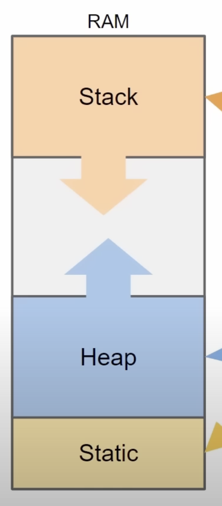

Photo of RAM.

The **stack is a last-in-first-out system (like a stack of pancakes)** (LIFO), while the heap is a **first-in-first-out system (like a line at a grocery store)** (FIFO). The **static portion stores our variables**. This **memory is permanent and is allocated before the program runs**. For any memory we want to **dynamically** add when we are running our program, that is added onto the **heap**. When running freeRTOS, if we create a **thread**, that is added onto the **heap**. Queues and semaphores are also added onto the heap. However, you can configure more senstive stuff from the heap onto the static portion of memory. There are different ways to manage the heap memory. Main goal of memory management is to ensure we don't run out of heap or stack memory.

### Race Conditions

Let's say we have multiple tasks that are all editing the same variable. If one tasks starts editing the variable and then is stopped before finishing, the second task will start editing and that will corrupt the data. Data corruption is bad. This is called a **race condition**

To prevent multiple tasks from editing the same variable we can use **queues, mutexes, and semaphores**. 

A **queue** is just like a line at a grocery store. The first task that comes in is the first task out (FIFO). You serve the first costumer before moving onto the next. This ensures that the groceries don't get mixed up. Adding tasks to the queue is atomic meaning it can't be interrupted and corrupted when it is occuring. Also, the **whole value of the task is added to the queue instead of just a reference**. Pointers can cause problems. Queues are good for intertask communication, not good for shared variables like global variables.

A **mutex** blocks off a piece of code so that only one task can edit it at a time. The piece of code it blocks off is called the critical section. When only one task is allowed to edit at a time, that is called mutual exclusion.

A **semaphore** is similar to a mutex but allows mutliple tasks into a critical section. We can define what the limit of the semaphore is. Usually, one of the tasks adds to the shared resource while another takes from it.

---

When running tasks on freeRTOS, the priority matters. Tasks with higher priority take precedence and run over tasks with lower priority. The tasks with the highest priority are hardware interrupts. If there are multiple hardware interrupts, that's called nested interrupts and the priority scheduling depends on the device you're using.
If you have multiple cores, different tasks can run at the same time. If you have one core, the tasks will run based off scheduling. This scheduling is determined every one tick.

**Be careful of one task hogging all the resources -- this is starvation**
Also,
**Be careful of when no task has enough resources but they're not willing to share -- this is deadlock**
You can also use freeRTOS to make software timers.

Why use freeRTOS? When you have many tasks you want to run and want to meet timing deadlines!

Below is how to implement RTOS into your project. We're going to be looking at the MBMS code!

You put the definitions for the threads (tasks), mutexes, and queues under private variables in the main.c:

Photo of what the 'private variables' section looks like.

Here you can set the priority of the task. This one is set to the normal priority. There are a bunch of different priority levels. To see them just hover over the (osPriority_t) cast. If you create a new project, there will be a 'default_task.' This tasks ensures something is always running.

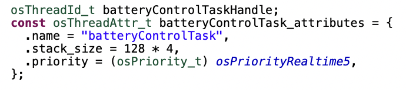

Photo of what a task definition looks like.

Here is the basis for defining mutexes as well:

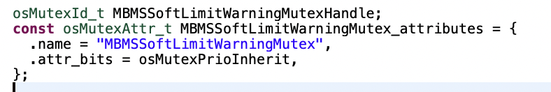

Photo of what a mutex definition looks like.

In the main(void) loop, you create the handles for your mutexes, queues, and flags. A handle is basically saying you don't need to worry about the specific of the resource, just use this handle to use it! 

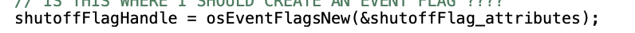

Photo of what setting a flag looks like.

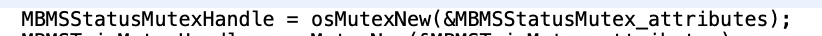

Photo of what setting a mutex looks like.

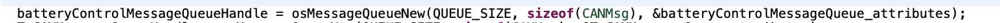

Photo of what setting a queue looks like.

You also start your tasks here. This is very important. Don't forget to start your task or your functions won't run! 

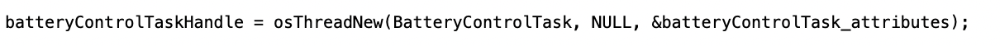

Photo of what setting a task looks like.

This is an instance of using a mutex. Here, Millaine (the coder) first aquired the mutex, checked it's status, did her operations, and then released the mutex.

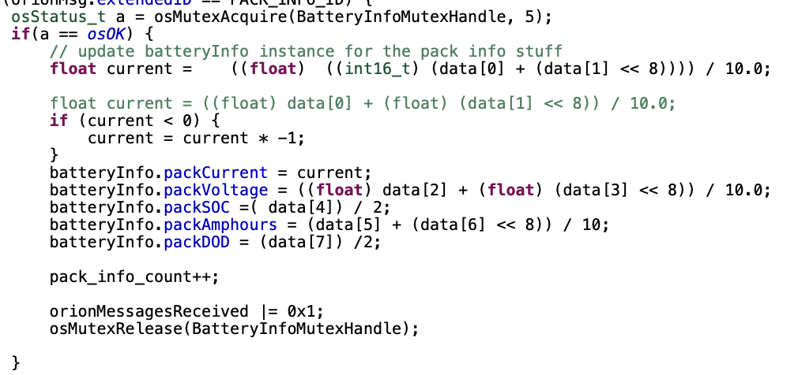

Photo of what using a mutex looks like.

This is an example of using a flag. This flag was used to signal that something bad happened. Flags are useful and Millaine used them a lot in the MBMS code.

Photo of what using a flag looks like.

So for tasks, what you're doing is you're making functions. In this example, we have a BatteryControlTask, CANMessageSenderTask, CANRxGatekeeperTask, etc. Don't worry about what these names mean right now. Just focus that they're files storing some functions.

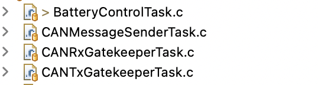

Photo of what the files looks like.

All of these files are always running. They have an infinite while loop at the top. You have to put that there.

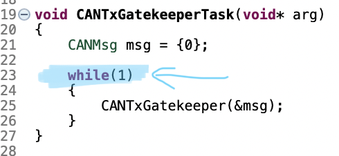

Photo of what the while loop looks like.

However, since all of them can't run at once, the one with the higher priority runs. These priorities are the ones you set in the main.c

That's basically what tasks are. Good job, you completed this section! By the way, the code above helps set priorities of tasks so the car doesn't blow up! Imagine if the priority for shutting off the car when there's a fault was low, that wouldn't end well... I hope you see how important priorities are! 

## Terminology
Task is similar to a thread

A tick is 1 millisecond

## Embedded Example with an STM32

Last Updated: October 1, 2025

Note: Adding examples

Author: Khadeeja Abbas

