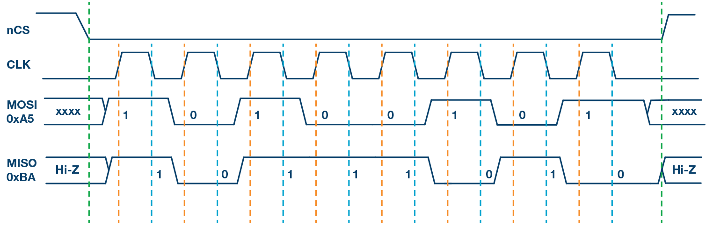

---
# Serial Peripheral Interface (SPI)
---
## What is SPI?
SPI (Serial Peripheral Interface) is a way for electronics to **talk to each other**. Usually, you have one **master** device (like your microcontroller) that controls the conversation, and one or more **slave** devices (like sensors, displays, or memory chips) that respond.

For example, our acceleration and regenerative braking pedals (slaves) use SPI to send data to the B3 Board (master).

It is made for **fast, short-distance communication**, which is why it is very common in embedded projects.

---

## The Main Signals
SPI uses up to **four wires**:

1. **MOSI (Master Out Slave In)**\
   The master sends data to the slave on this line.

2. **MISO (Master In Slave Out)**\
   The slave sends data back to the master on this line.

3. **SCLK (Serial Clock)**\
   The master makes a clock signal so both sides know when to send and read data.

4. **CS / SS (Chip Select / Slave Select)**\
   The master pulls this line **low** to tell a specific slave, “Hey, I am talking to you now.”

### Example

---

## SPI Modes (Clock Settings)
SPI has 4 modes, which just decide when data gets read compared to the clock.  

- **CPOL**: Is the clock normally high or low?  
- **CPHA**: Do we read on the first or second edge of the clock?  

| Mode | CPOL | CPHA | Clock Default | Data Read On |
|------|------|------|---------------|--------------|
| 0    | 0    | 0    | Low           | Rising edge  |
| 1    | 0    | 1    | Low           | Falling edge |
| 2    | 1    | 0    | High          | Falling edge |
| 3    | 1    | 1    | High          | Rising edge  |

**both master and slave must agree on the same mode**.

---

## Steps for SPI Communication
1. The master pulls the **CS** pin low to pick which slave it wants to talk to.  
2. The master starts toggling the **clock line (SCLK)**.  
3. Data goes out from the master on **MOSI** and comes back from the slave on **MISO**.  
4. Both sides read data on clock edges (depending on the clock settings).  
5. When finished, the master sets **CS high** again to deselect the slave.

---

## Why Use SPI?
### Pros:
- It is very fast compared to UART or I2C.
- You can send and receive at the same time (full-duplex).
- The wiring is simple when you have just one slave.
- Supports multiple slaves with just one master; One CS line per slave.

### Cons:
- It uses more pins, especially if you have a lot of slaves.
- No built-in data verification or correction.
- Not good over long distances.
- Only one slave can talk at a time (watch out for data collisions!)

---

## TLDR
- SPI is a **fast way for chips to talk**.  
- Uses **MOSI, MISO, SCLK, and CS**.  
- Master controls the clock and selects which slave to talk to. 
- Needs the right **mode (0–3)** on both ends.
- Perfect for sensors, screens, and memory chips.

