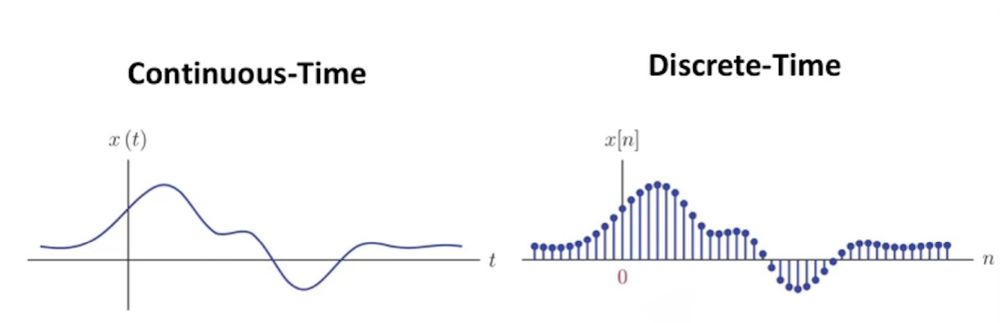
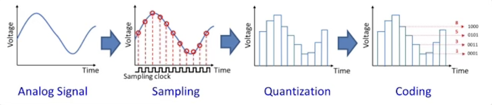

<link rel="stylesheet" href="../styles.css">

# Analog-to-Digital Converter (ADC)
----
## Signals
A **signal** is a detectable physical quantity (e.g. voltage, current, etc.) by which information can be transmitted. Typically, microcontrollers detect signals as voltages.

There are two standard frameworks used to view and analyze signals: 

- **continuous-time**:  time variations are considered on an infinitesimal scale
- **discrete-time**: time variations are considered in discrete steps

**Example**

Examples of continuous variables: temperature, distance, etc.
Examples of discrete variables: ice cream flavours, number of people, etc.

 

**Extra**

Typically, discrete values cannot be broken down more!!

The real world is analog, but our microcontroller is digital!

## Digital vs Analog

An **analog** signal refers to a continuously-valued signal, meanwhile…

A **digital** signal refers to a discretely-valued signal, where its magnitude is determined by quantization of each discrete point in time

- **quantization** assigns a single number to represent a range of magnitudes of a continuous signal

The world is often analog, but our microcontrollers can only operate with discrete values…

So how do we resolve this?

**Extra**

Ok so whats the difference between analog, digital, continuous, and discrete?

- In my mind, I think of it as how discrete-time and continuous-time describe the x-axis (time), where continuous means we know the y-axis value at every single point in time, and discrete meaning we only know the y-axis value at specific points in time. Analog and digital can be thought of as describing the y-axis (or the magnitude), where analog means the y-axis value can be any value, but a digital signal is one that samples a signal and performs quantization, resulting in a y-axis value that is discrete! ADC is necessary because digitally, we cannot represent something continuous (because everything needs some sort of bit representation), and so we quantize the values using a certain resolution. A higher bit resolution means that the y-axis value can be more specific/similar to its true real world value.

## Analog-to-Digital Converter (ADC)

Physical quantities are captured by some sort of sensor, and are usually reflected as something such as a voltage (usually with infinite values in between due to being continuous). 

We can convert the analog signal to a digital representation by using sampling, and quantization.

- **Sampling** is measuring the signal at a periodic rate

**Resolution** is defined as: *resolution* = Vref/2^n 
- It is the number of volts between successive digital encodings
- n = number of biys for each sample
- This equation assumes a minimum voltage of 0V

**Example**

For example, this is how 10-bit resolution would work:

Since there are 10 bits, 2^10 is 1024. This means there are 1024 discrete values we can use (0-1023). If we had a sensor to detect a voltage ranging from 0-3V, receiving the ADC value of 1002 would mean that it is currently sensing a voltage of (1002/1024) * 3V = 2.94V.

